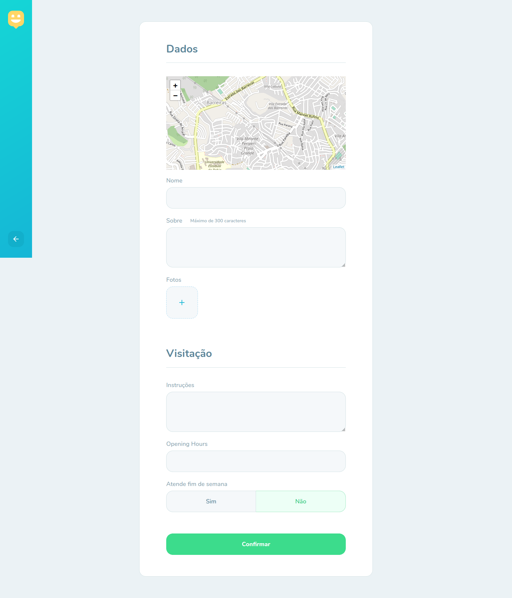

# happy

<i>Project developed in Next Level Week from Rocketseat.</i>
  
<strong> Happy </strong> helps people find orphanages to visit. It points orphanages on the map and shows details to facilitate and inform visitors. it's showed schedule, visit duration and any other requirement to get a visit.

## Tecnologies

#### Front-end
- React --typescript
- Leaflet
#### Back-end
- Node.js --typescript
- Express
- Knex

## Screenshots

    
    
    
    

